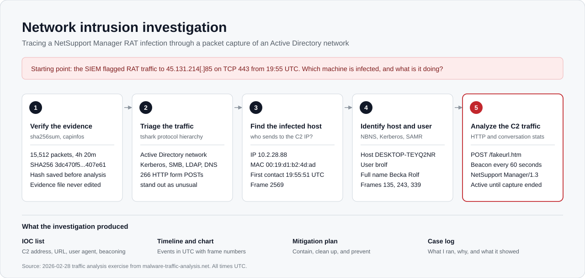

# Network Intrusion Detection and Incident Investigation

> **Note:** This workflow was made by claude after i did already derive the answers on my own,I just simply used ai for documentation and help in syntax ( since im still fairly new to linux)

I analyzed a packet capture from a Windows Active Directory network to find out which machine was infected with a remote access trojan (NetSupport Manager RAT), who was using it, and what the malware was doing. This was done as a SOC analyst exercise using Wireshark and tshark on Kali Linux.


## What happened

At 19:55:51 UTC on 2026-02-28, the workstation DESKTOP-TEYQ2NR (10.2.28.88) connected to 45.131.214\[.]85 on TCP 443. From then on it sent one HTTP POST to the same fake page every 60 seconds, announcing itself as NetSupport Manager. The beaconing continued until the last second of the capture, about 4 hours 20 minutes, so the host was still compromised when the recording ended.

## Findings

|Question|Answer|Evidence|
|-|-|-|
|Infected IP|10.2.28.88|frame 2569, `output/04\_c2\_ip\_mac.txt`|
|MAC address|00:19:d1:b2:4d:ad|frame 2569, `output/04\_c2\_ip\_mac.txt`|
|Host name|DESKTOP-TEYQ2NR|NBNS, frame 135, `output/05\_hostname.txt`|
|User account|brolf|Kerberos, frame 243, `output/06\_username.txt`|
|Full name|Becka Rolf|SAMR reply, frame 339, `output/07\_fullname\_frame339.txt`|

Screenshots of each finding are in [Screenshots](case01/screenshots/).

## Process

1. Hashed the pcap and read its metadata, so the evidence is verifiable (`sha256sum`, `capinfos`).
2. Looked at the protocol mix to see what kind of network this was (`tshark -z io,phs`). Kerberos, SMB and LDAP showed it was an AD domain, and 266 HTTP form POSTs stood out.
3. The SIEM alert named the C2 address, so I filtered for packets sent to it. The sender was the same host every time, which gave the IP and MAC.
4. Pivoted from that host to its NBNS announcements (host name), its Kerberos login (account name), and the domain controller's SAMR reply (full name).
5. Read the HTTP requests to the C2 server and the conversation statistics to characterize the behavior.

Example of the filter used in step 3:

```bash
tshark -r evidence/2026-02-28-traffic-analysis-exercise.pcap \\
  -Y "ip.dst==45.131.214.85" \\
  -T fields -e frame.number -e frame.time\_utc -e eth.src -e ip.src -e ip.dst -e tcp.dstport
```

## Indicators of compromise

|Type|Value|
|-|-|
|C2 IP address|45.131.214\[.]85|
|Port|443/tcp (plain HTTP, not TLS)|
|URL|http://45.131.214\[.]85/fakeurl.htm|
|User agent|NetSupport Manager/1.3|
|Behavior|one POST every 60 seconds, from 19:55:51 UTC to the end of the capture|

Full list in [`IOCS`](case01/notes/iocs.md).

## Timeline

!\[Timeline](deliverables/timeline.png)

|Time|Event|
|-|-|
|19:55:11|Host announces its name, DESKTOP-TEYQ2NR|
|19:55:23|User brolf logs in through the domain controller|
|19:55:51|First connection to the C2 server|
|19:56:52 onward|Beaconing, one POST per minute|
|00:16:28 (Mar 1)|Last beacon; capture ends seven seconds later|

The event list with frame numbers is in [`timeline.csv`](case01/notes/timeline.csv).

## Recommendations

* Isolate DESKTOP-TEYQ2NR and block 45.131.214\[.]85 at the firewall.
* Reset the password for brolf and review where the account was used.
* Search proxy and firewall logs for other hosts contacting the C2 address or sending POSTs to `/fakeurl.htm`.
* Block unapproved remote access tools, and alert on regular beaconing and on plain HTTP over port 443.

Full list in [`mitigations.md`](case01/notes/mitigations.md).

## Limitations

* This capture starts about 45 seconds before the first C2 contact, so I could not determine how the infection started.
* The host sent about 78 kB to the C2 server and received about 17 kB. That is not enough on its own to say data was stolen, and I did not analyze the payloads.
* Everything here comes from one capture. A real investigation would also use endpoint and proxy logs.

## Repository layout

```
evidence/       hashes of the capture (the pcap itself is not included)
output/         raw tshark output, numbered in the order I ran it
screenshots/    Wireshark screenshots for each finding
notes/          case log, IOCs, timeline, mitigations
deliverables/   flow diagram, timeline chart, chart script
```

The step-by-step record of what I ran and why is in [`log.md`](case01/notes/log.md).

